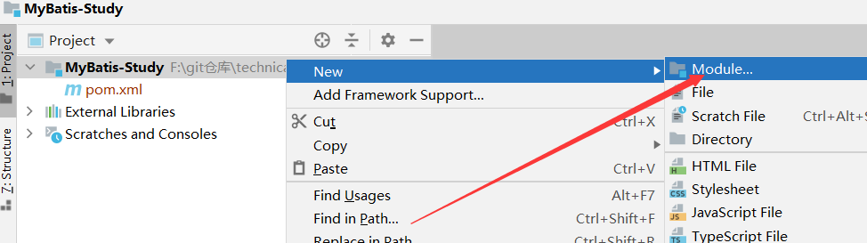

# MyBatis 简介

mybatis3 中文文档官网：https://mybatis.org/mybatis-3/zh/index.html

GitHub 源码网址：https://github.com/mybatis/mybatis-3

**最新版本是MyBatis 3.5.5 ，其发布时间是2020年6月4日。**

Maven 仓库依赖：

```xml
<!-- 目前最新的 mybatis 版本 -->
<dependency>
    <groupId>org.mybatis</groupId>
    <artifactId>mybatis</artifactId>
    <version>3.5.5</version>
</dependency>
```

# 第一个MyBatis测试

## 1、 创建测试数据库

```sql
-- 创建测试数据库
CREATE DATABASE `mybatis`;

-- 使用此数据库
USE `mybatis`;

-- 创建 user 表
CREATE TABLE user(
	`id` INT(11) NOT NULL AUTO_INCREMENT PRIMARY KEY,
	`name` VARCHAR(30) NOT NULL,
	`pwd` VARCHAR(30) NOT NULL
)ENGINE=INNODB CHARSET UTF8;

-- 添加3条测试数据
INSERT INTO user(`name`, `pwd`) VALUES
('张三', '864531'),
('李四', '1564513'),
('刘鹏飞', '9846513')
```


## 2、 搭建项目

使用 IDEA 创建一个空的 maven 项目


然后删除其中的 src 目录，将此工程作为一个父工程。

## 3、 添加 maven 依赖

```xml
<dependencies>
        <!-- mysql 依赖 -->
        <dependency>
            <groupId>mysql</groupId>
            <artifactId>mysql-connector-java</artifactId>
            <version>5.1.47</version>
        </dependency>

        <!-- mybatis 依赖 -->
        <dependency>
            <groupId>org.mybatis</groupId>
            <artifactId>mybatis</artifactId>
            <version>3.5.5</version>
        </dependency>

        <!-- junit 依赖 -->
        <dependency>
            <groupId>junit</groupId>
            <artifactId>junit</artifactId>
            <version>4.12</version>
        </dependency>

        <!-- lombok 依赖 -->
        <dependency>
            <groupId>org.projectlombok</groupId>
            <artifactId>lombok</artifactId>
            <version>1.18.12</version>
        </dependency>
    </dependencies>
```

## 4、 添加第一个测试子 module 项目




## 5、创建 pojo 实体类

使用 @Data 注解可以省去写大量的 getter/setter 方法

```java
package com.bai.pojo;

import lombok.Data;

import java.io.Serializable;

/**
 * @author: 南独酌酒 <211425401@126.com>
 * @date: 2020/10/15 21:54
 */
@Data
public class User implements Serializable {
    private Integer id;
    private String name;
    private String pwd;
}
```

## 6、 配置 MyBatis 核心文件 mybatis-config.xml

```xml
<?xml version="1.0" encoding="UTF-8" ?>
<!DOCTYPE configuration
        PUBLIC "-//mybatis.org//DTD Config 3.0//EN"
        "http://mybatis.org/dtd/mybatis-3-config.dtd">
<!-- mybatis 核心配置 -->
<configuration>
    <!-- 运行环境 -->
    <environments default="development">
        <environment id="development">
            <transactionManager type="JDBC"/>
            <dataSource type="POOLED">
                <property name="driver" value="com.mysql.jdbc.Driver"/>
                <property name="url" value="jdbc:mysql://localhost:3306/mybatis?useSSL=true&amp;useUnicode=true&amp;characterEncoding=utf8"/>
                <property name="username" value="root"/>
                <property name="password" value="123456"/>
            </dataSource>
        </environment>
    </environments>
</configuration>
```

## 7、 创建一个工具类

此工具类用于获取 SqlSession 的类

```java
import org.apache.ibatis.io.Resources;
import org.apache.ibatis.session.SqlSession;
import org.apache.ibatis.session.SqlSessionFactory;
import org.apache.ibatis.session.SqlSessionFactoryBuilder;

import java.io.IOException;
import java.io.InputStream;

/**
 * @author: 南独酌酒 <211425401@126.com>
 * @date: 2020/10/15 22:04
 */
public class MyBatisUtil {

    private static SqlSessionFactory sqlSessionFactory;

    static {
        try {
            // 初始化构建 SqlSessionFactory
            String resource = "mybatis-config.xml";
            InputStream inputStream = Resources.getResourceAsStream(resource);
            sqlSessionFactory = new SqlSessionFactoryBuilder().build(inputStream);
        } catch (IOException e) {
            e.printStackTrace();
        }
    }

    /**
     * 通过 SqlSessionFactory 创建一个 SqlSession 对象
     *
     * @return SqlSession 对象
     */
    public static SqlSession getSqlSession() {
        return sqlSessionFactory.openSession();
    }
}
```

## 8、 添加 UserMapper 接口

```java
import com.bai.pojo.User;

import java.util.List;

/**
 * @author: 南独酌酒 <211425401@126.com>
 * @date: 2020/10/15 22:07
 */
public interface UserMapper {

    /**
     * 查询所有用户信息
     *
     * @return 用户信息
     */
    public List<User> getUserList();
}
```

## 9、 添加 UserMapper.xml 配置文件编写 SQL

```xml
<?xml version="1.0" encoding="UTF-8" ?>
<!DOCTYPE mapper
        PUBLIC "-//mybatis.org//DTD Mapper 3.0//EN"
        "http://mybatis.org/dtd/mybatis-3-mapper.dtd">
<mapper namespace="com.bai.dao.UserMapper">

    <!-- 查询所有用户信息 -->
    <select id="getUserList" resultType="com.bai.pojo.User">
        select * from mybatis.user;
    </select>

</mapper>
```

## 10、 添加测试类测试

```java
import com.bai.dao.UserMapper;
import com.bai.pojo.User;
import com.bai.util.MyBatisUtil;
import org.apache.ibatis.session.SqlSession;
import org.junit.Test;

import java.util.List;

/**
 * @author: 南独酌酒 <211425401@126.com>
 * @date: 2020/10/15 22:11
 */
public class UserMapperTest {

    @Test
    public void test01() {
        SqlSession sqlSession = null;
        try {
            // 1.获取到 SqlSession 对象那个
            sqlSession = MyBatisUtil.getSqlSession();
            // 2.通过 getMapper 方法加载对应的 UserMapper 接口
            UserMapper mapper = sqlSession.getMapper(UserMapper.class);
            // 3.执行接口方法
            List<User> userList = mapper.getUserList();
            for (User user : userList) {
                System.out.println(user);
            }
        } catch (Exception e) {
            e.printStackTrace();
        } finally {
            // 4.关闭 sqlSession 对象
            if (sqlSession != null) {
                sqlSession.close();
            }
        }
    }

}
```

然后通过运行我们发现一个被遗忘的问题， UserMapper文件并没有被注册到 MapperRegistry 中

`Type interface com.bai.dao.UserMapper is not known to the MapperRegistry.`

我们要解决这个问题，需要在 mybatis-config.xml 文件中注册此 Mapper 文件


然后我们还有遇到一个初始化异常错误

`Error parsing SQL Mapper Configuration. Cause: java.io.IOException: Could not find resource com/bai/dao/UserMapper.xml`

发生这个错误是因为在 java 源码中并不能加载 xml 类型的文件，要解决这个问题，需要修改一个 pom.xml 文件，添加一些配置

```xml
<?xml version="1.0" encoding="UTF-8"?>
<project xmlns="http://maven.apache.org/POM/4.0.0"
         xmlns:xsi="http://www.w3.org/2001/XMLSchema-instance"
         xsi:schemaLocation="http://maven.apache.org/POM/4.0.0 http://maven.apache.org/xsd/maven-4.0.0.xsd">
    <modelVersion>4.0.0</modelVersion>

    <!-- 父工程 -->
    <groupId>com.bai</groupId>
    <artifactId>MyBatis-Study</artifactId>
    <packaging>pom</packaging>
    <version>1.0-SNAPSHOT</version>
    <modules>
        <module>mybatis-01</module>
    </modules>

    <dependencies>
        <!-- mysql 依赖 -->
        <dependency>
            <groupId>mysql</groupId>
            <artifactId>mysql-connector-java</artifactId>
            <version>5.1.47</version>
        </dependency>

        <!-- mybatis 依赖 -->
        <dependency>
            <groupId>org.mybatis</groupId>
            <artifactId>mybatis</artifactId>
            <version>3.5.5</version>
        </dependency>

        <!-- junit 依赖 -->
        <dependency>
            <groupId>junit</groupId>
            <artifactId>junit</artifactId>
            <version>4.12</version>
        </dependency>

        <!-- lombok 依赖 -->
        <dependency>
            <groupId>org.projectlombok</groupId>
            <artifactId>lombok</artifactId>
            <version>1.18.12</version>
        </dependency>
    </dependencies>

    <build>
        <resources>
            <resource>
                <directory>src/main/resources</directory>
                <includes>
                    <!-- 支持 properties 在 resources 包中存在 -->
                    <include>**/*.properties</include>
                    <!-- 支持 xml 文件在 resources 包中存在 -->
                    <include>**/*.xml</include>
                </includes>
                <!-- 是否过滤 : 是 -->
                <filtering>true</filtering>
            </resource>
            <resource>
                <directory>src/main/java</directory>
                <includes>
                    <!-- 支持 properties 在 java 包中存在 -->
                    <include>**/*.properties</include>
                    <!-- 支持 xml 文件在 java 包中存在 -->
                    <include>**/*.xml</include>
                </includes>
                <!-- 是否过滤 : 是 -->
                <filtering>true</filtering>
            </resource>
        </resources>
    </build>
</project>
```

测试结果


# CURD

- `namespace` Mapper.xml 文件的命名空间，用来寻找要实现的接口
- `id` 类似于方法名，唯一存在
- `resultType` 返回值类型，基本上就是 Class 类型或者就是8大基本类型
- `parameterType` 参数类型

## select

1. 编写接口

   ```java
   /**
        * 跟据 id 查询用户信息
        *
        * @param id 查询条件
        * @return 用户信息
        */
       public User getUserById(int id);
   ```

   

2. 编写 xml 中的 sql 语句

   ```xml
    <!-- 跟据 id 查询用户信息 -->
       <select id="getUserById" resultType="com.bai.pojo.User" parameterType="int">
           select * from mybatis.user where id = #{id};
       </select>
   ```

   

3. 测试

   ```java
   	@Test
       public void getUserById() {
           SqlSession sqlSession = MyBatisUtil.getSqlSession();
           UserMapper mapper = sqlSession.getMapper(UserMapper.class);
           User user = mapper.getUserById(1);
           System.out.println(user);
           sqlSession.close();
       }
   ```

   

## insert

## update

## delete

```java
	@Test
    public void addUser() {
        SqlSession sqlSession = MyBatisUtil.getSqlSession();
        UserMapper mapper = sqlSession.getMapper(UserMapper.class);
        mapper.addUser(new User(4, "哈哈", "135463"));
        sqlSession.commit();    // 一定要记住提交事务
        sqlSession.close();
    }

    @Test
    public void updateUser() {
        SqlSession sqlSession = MyBatisUtil.getSqlSession();
        UserMapper mapper = sqlSession.getMapper(UserMapper.class);
        mapper.updateUser(new User(4, "呵呵", "66666"));
        sqlSession.commit();    // 一定要记住提交事务
        sqlSession.close();
    }

    @Test
    public void deleteUser() {
        SqlSession sqlSession = MyBatisUtil.getSqlSession();
        UserMapper mapper = sqlSession.getMapper(UserMapper.class);
        mapper.deleteUser(4);
        sqlSession.commit();
        sqlSession.close();
    }
```

**通过 sqlSession.commit 方法来提交事务**

**注意：增删改一定要提交事务，这样才会将修改的数据更新回数据库中。**

# XML 配置

mybatis-config.xml 核心配置文件。

MyBatis 的配置文件包含了会深深影响 MyBatis 行为的设置和属性信息

## configuration 配置


## properties

1. 在外部 resource 文件下创建 db.properties 数据库连接文件

   ```properties
   driver=com.mysql.jdbc.Driver
   url=jdbc:mysql://localhost:3306/mybatis?useSSL=true&useUnicode=true&characterEncoding=utf8
   username=root
   password=123456
   ```

2. 然后通过 properties 配置到 mybatis 核心配置文件中读取

3. 测试代码是否能够正常运行

方式一：直接引入外部文件

```xml
<properties resource="db.properties"/>

<environments default="development">
        <environment id="development">
            <transactionManager type="JDBC"/>
            <dataSource type="POOLED">
                <property name="driver" value="${driver}"/>
                <property name="url" value="${url}"/>
                <property name="username" value="${username}"/>
                <property name="password" value="${password}"/>
            </dataSource>
        </environment>
    </environments>
```

方式二：在 properties 标签内部通过 property 属性定义属性

```properties
driver=com.mysql.jdbc.Driver
url=jdbc:mysql://localhost:3306/mybatis?useSSL=true&useUnicode=true&characterEncoding=utf8
```

```xml
<properties resource="db.properties">
        <property name="user" value="root"/>
        <property name="pwd" value="123456"/>
    </properties>

    <!-- 运行环境 -->
    <environments default="development">
        <environment id="development">
            <transactionManager type="JDBC"/>
            <dataSource type="POOLED">
                <property name="driver" value="${driver}"/>
                <property name="url" value="${url}"/>
                <property name="username" value="${user}"/>
                <property name="password" value="${pwd}"/>
            </dataSource>
        </environment>
    </environments>
```

当二者同时配置了相同的信息，优先读取外部的 db.properties 文件

## typeAliases 类型别名

- 类型别名可为 Java 类型设置一个缩写名字
- 意在降低冗余的全限定类名书写

方式一：通过 typeAlias 方式配置对应的类名

```xml
<typeAliases>
        <typeAlias type="com.bai.pojo.User" alias="User"/>
    </typeAliases>	
```

通过配置别名，resultType 可以直接使用别名的方式来。

```xml
 <!-- 查询所有用户信息 -->
    <select id="getUserList" resultType="User">
        select * from mybatis.user;
    </select>
```

方式二：通过 package 包名的方式来配置

```xml
<typeAliases>
        <package name="com.bai.pojo"/>
    </typeAliases>
```

resultType 直接写 Class 类名即可，小写字母开头

```xml
<!-- 查询所有用户信息 -->
    <select id="getUserList" resultType="user">
        select * from mybatis.user;
    </select>
```

如果使用了 package 的方式配置，又不想使用默认的小写字母类名，可以通过配置注解的方式来使用。

```java
@Alias("hello")
@Data
@AllArgsConstructor
@NoArgsConstructor
public class User implements Serializable {
    private Integer id;
    private String name;
    private String pwd;
}
```

resultType 直接使用 @Alias 注解中声明的名称即可

```xml
<!-- 查询所有用户信息 -->
    <select id="getUserList" resultType="hello">
        select * from mybatis.user;
    </select>
```

## 映射器 mappers

方式一：通过 resource 方式配置

```xml
<mappers>
	<mapper resource="com/bai/dao/UserMapper.xml"/>
</mappers>
```

方式二：通过 class 方式配置

```xml
<mappers>
	<mapper class="com.bai.dao.UserMapper"/>
</mappers>
```

方式三：通过 package 方式配置

```xml
<mappers>
	<package name="com.bai.dao"/>
</mappers>
```

注意点：接口和 xml 文件一定要同名，并且放在同一个包中。

不注意的话可能会出现各种各样的错误。


## environments 环境配置

可以通过此配置指定多种环境的数据库连接配置

比如你现在创建了3套环境、开发、测试、生产

然后我们可以使用 default 属性来切换不同的环境

```xml
<environments default="test">
        <!-- 开发环境 -->
        <environment id="development">
            <transactionManager type="JDBC"/>
            <dataSource type="POOLED">
                <property name="driver" value="${driver}"/>
                <property name="url" value="${url}"/>
                <property name="username" value="${username}"/>
                <property name="password" value="${password}"/>
            </dataSource>
        </environment>
        
        <!-- 测试环境 -->
        <environment id="test">
            <transactionManager type="JDBC"/>
            <dataSource type="POOLED">
                <property name="driver" value="${driver}"/>
                <property name="url" value="${url}"/>
                <property name="username" value="${username}"/>
                <property name="password" value="${password}"/>
            </dataSource>
        </environment>
        
        <!-- 生产环境 -->
        <environment id="product">
            <transactionManager type="JDBC"/>
            <dataSource type="POOLED">
                <property name="driver" value="${driver}"/>
                <property name="url" value="${url}"/>
                <property name="username" value="${username}"/>
                <property name="password" value="${password}"/>
            </dataSource>
        </environment>
    </environments>
```

- 事务管理器 transactionManager

  他有两种类型，JDBC 、 MANAGED

  

- 数据源 dataSource

  UNPOOLED、POOLED、JNDI
  
# 日志

## stdout_logging

在 MyBatis 核心核心配置文件中添加配置

  ```xml
  	<!-- 基本设置 -->
      <settings>
          <!-- STDOUT_LOGGING 日志实现 -->
          <setting name="logImpl" value="STDOUT_LOGGING"/>
      </settings>
  ```

  

 

## log4j

### log4j 简介

- Log4j是[Apache](https://baike.baidu.com/item/Apache/8512995)的一个开源项目，通过使用Log4j，我们可以控制日志信息输送的目的地是[控制台](https://baike.baidu.com/item/控制台/2438626)、文件、[GUI](https://baike.baidu.com/item/GUI)组件
- 可以控制每一条日志的输出格式；通过定义每一条日志信息的级别
- 可以通过一个[配置文件](https://baike.baidu.com/item/配置文件/286550)来灵活地进行配置，而不需要修改应用的代码

### 如何在项目中使用 log4j

1. 引入 Maven 依赖

   ```xml
   <dependency>
       <groupId>log4j</groupId>
       <artifactId>log4j</artifactId>
       <version>1.2.17</version>
   </dependency>
   ```

2. 创建 log4j.properties 文件

   ```properties
   # 将等级为DEBUG的日志信息输出到console和file这两个目的地,console和file的定义在下面的代码
   log4j.rootLogger=DEBUG,console,file
   
   # 控制台输出的相关配置
   log4j.appender.console=org.apache.log4j.ConsoleAppender
   log4j.appender.console.Target=System.out
   log4j.appender.console.Threshold=DEBUG
   log4j.appender.console.layout=org.apache.log4j.PatternLayout
   log4j.appender.console.layout.ConversionPattern=[%c]-%m%n
   
   # 文件输出的相关配置
   log4j.appender.file=org.apache.log4j.RollingFileAppender
   log4j.appender.file.File=./log/bai.log
   log4j.appender.file.MaxFileSize=10MB
   log4j.appender.file.Threshold=DEBUG
   log4j.appender.file.layout=org.apache.log4j.PatternLayout
   log4j.appender.file.layout.ConversionPattern=[%p][%d{yyyy-MM-dd HH:mm:ss}][%c]-%m%n
   
   # 日志输出级别
   log4j.logger.org.mybatis=DEBUG
   log4j.logger.java.sql=DEBUG
   log4j.logger.java.sql.Statement=DEBUG
   log4j.logger.java.sql.ResultSet=DEBUG
   log4j.logger.java.sql.PreparedStatement=DEBUG
   ```

3. 修改 MyBatis 核心配置文件，配置日志选项

   ```xml
   <!-- 基本设置 -->
       <settings>
           <setting name="logImpl" value="LOG4J"/>
       </settings>
   ```

4. 测试

   当前项目根目录下会生成一个 /log 文件夹，文件夹中的内容就是刚才输出的日志。

# 分页

## Limit 分页

1. UserMapper

   ```java
   /**
        * limit 分页实现查询用户信息
        *
        * @param map 条件
        * @return 用户信息
        */
       public List<User> getUserLimit(Map<String, Integer> map);
   ```

2. UserMapper.xml

   ```xml
    <!-- limit 分页实现查询用户信息 -->
       <select id="getUserLimit" parameterType="map" resultType="user">
           select * from mybatis.user limit #{pageNo},#{pageSize}
       </select>
   ```

   

3. 测试

   ```java
    @Test
       public void getUserLimit() {
           // limit 分页实现
           SqlSession sqlSession = MyBatisUtil.getSqlSession();
   
           UserMapper mapper = sqlSession.getMapper(UserMapper.class);
           Map<String, Integer> map = new HashMap<String, Integer>(2);
           map.put("pageNo", 1);
           map.put("pageSize", 2);
           List<User> list = mapper.getUserLimit(map);
           for (User user : list) {
               System.out.println(user);
           }
   
           sqlSession.close();
       }
   ```

   

## RowBounds 分页

1. UserMapper

   ```java
   /**
        * 使用 RowBounds 方式实现分页
        *
        * @return 用户信息
        */
       public List<User> getUserRowBounds();
   ```

   

2. UserMapper.xml

   ```xml
   <!-- 使用 RowBounds 方式实现分页 -->
       <select id="getUserRowBounds" resultType="user">
           select * from mybatis.user
       </select>
   ```

   

3. 测试

   ```java
    @Test
       public void getUserRowBounds() {
           // 使用 RowBounds 方式实现分页
           SqlSession sqlSession = MyBatisUtil.getSqlSession();
   
           RowBounds rowBounds = new RowBounds(2, 2);
           List<User> list = sqlSession.selectList("com.bai.dao.UserMapper.getUserRowBounds", null, rowBounds);
           for (User user : list) {
               System.out.println(user);
           }
   
           sqlSession.close();
       }
   ```

## MyBatis PageHelper 分页插件

文档：https://pagehelper.github.io/docs/howtouse/

# 注解开发

## @Select 注解

1. 直接在 UserMapper 接口中使用 @Select 注解来编写 SQL 即可

   ```java
   /**
        * 查询全部用户
        *
        * @return 用户信息
        */
       @Select("select * from user")
       List<User> getUserList();
   ```

   

2. 测试

   ```java
   @Test
       public void getUserList() {
           // 测试 @Select 注解
           SqlSession sqlSession = MyBatisUtil.getSqlSession();
   
           UserMapper mapper = sqlSession.getMapper(UserMapper.class);
           List<User> list = mapper.getUsers();
           for (User user : list) {
               System.out.println(user);
           }
   
           sqlSession.close();
       }
   ```

   

**注意：使用注解开发一定要在 mybatis 的核心配置文件中添加配置映射**

```xml
<!-- 配置映射 -->
    <mappers>
        <mapper class="com.bai.dao.UserMapper"/>
    </mappers>
```

## @Param 注解

1. 一般使用多个参数的话必须使用 @Param 注解传参
2. 基本类型使用 @Param ，引用类型不需要使用此注解
3. sql 语句获取其中的 @Param("value") Value 值来使用即可

## 自动设置事务提交

更改 MyBatisUtil 工具类

通过 sqlSessionFactory.openSession(true); 的重载方法可以开启自动提交事务。

```java
	/**
     * 通过 SqlSessionFactory 创建一个 SqlSession 对象
     *
     * @return SqlSession 对象
     */
    public static SqlSession getSqlSession() {
        return sqlSessionFactory.openSession(true);
    }
```

**开启了自动提交事务后，增删改就不需要手动提交事务了。**

## @Insert 注解

```java
	/**
     * 新增用户
     *
     * @param user 新增数据
     */
    @Insert("insert into user(id, name, pwd) values(#{id}, #{name}, #{pwd})")
    void addUser(User user);


	// 测试

	@Test
    public void addUser() {
        // 测试 @Select 注解
        SqlSession sqlSession = MyBatisUtil.getSqlSession();

        UserMapper mapper = sqlSession.getMapper(UserMapper.class);
        mapper.addUser(new User(5, "Hello", "333"));

        sqlSession.close();
    }
```


## @Delete 注解

```java
	/**
     * 更新用户信息
     *
     * @param user 更新数据
     */
    @Update("update user set name = #{name},pwd = #{pwd} where id = #{id}")
    void updateUser(User user);


	// 测试
	@Test
    public void updateUser() {
        // 测试 @Select 注解
        SqlSession sqlSession = MyBatisUtil.getSqlSession();

        UserMapper mapper = sqlSession.getMapper(UserMapper.class);
        mapper.updateUser(new User(5, "魔教教主", "777"));

        sqlSession.close();
    }

```


## @Update 注解

```java
	/**
     * 删除用户
     *
     * @param id 删除条件
     */
    @Delete("delete from user where id = #{uid}")
    void deleteById(@Param("uid") int id);


	// 测试
	@Test
    public void deleteById() {
        // 测试 @Select 注解
        SqlSession sqlSession = MyBatisUtil.getSqlSession();

        UserMapper mapper = sqlSession.getMapper(UserMapper.class);
        mapper.deleteById(5);

        sqlSession.close();
    }
```

## #{} 和 ${} 的区别

#{} 是预编译执行 sql 的

${} 不是预编译

#{} 能够有效防止 sql 注入，推荐使用 #{} 

# Lombok 注解

## 项目中使用 lombok

1. IDEA 安装 Lombok 插件

   

2. 项目中引入 Lombok 依赖即可使用

   ```xml
   <!-- lombok 依赖 -->
           <dependency>
               <groupId>org.projectlombok</groupId>
               <artifactId>lombok</artifactId>
               <version>1.18.12</version>
           </dependency>
   ```

## lombok 常用注解

```java
@Getter and @Setter	// 给属性添加 getter 和 setter 方法
@ToString	// 添加 toString() 方法
@EqualsAndHashCode	// 在类中添加 equals() hashCode() 方法
@AllArgsConstructor	// 在类中添加一个全参构造函数
@NoArgsConstructor	// 在类中添加一个无参构造
@Slf4j	// 日志
@Data	// 类上面一般默认都是使用此注解 
    // 添加了 @Data 注解，会在类中生成 getter/setter/toString()/hashCode() 和 无参构造等方法
```

# ResultMap 多对一实现

```xml
<select id="getStudents" resultMap="BaseStudentMap">
        select s.id sid,s.name sname,t.name tname
        from student s
        left join teacher t on s.tid = t.id
    </select>

    <resultMap id="BaseStudentMap" type="com.bai.pojo.Student">
        <id property="id" column="sid"/>
        <result property="name" column="sname"/>
        <association property="teacher" javaType="com.bai.pojo.Teacher">
            <result property="name" column="tname"/>
        </association>
     </resultMap>
```

# ResultMap 一对多实现

```xml
<select id="getById" resultMap="BaseResultMap">
        select s.id sid,s.name sname,t.id tid,t.name tname from student s
        left join teacher t on s.tid = t.id
    </select>

    <resultMap id="BaseResultMap" type="com.bai.pojo.Teacher">
        <id property="id" column="tid"/>
        <result property="name" column="tname"/>
        <collection property="studentList" ofType="com.bai.pojo.Student">
            <result property="name" column="sname"/>
        </collection>
    </resultMap>
```

- association 单个对象下使用
- collection 集合情况下使用
- 其中一定要注意 property 属性填写的是实体类中创建的属性、而 column 是 sql 语句查询的列名称，如果给 sql 语句查询的字段起了别名，一定在使用别名