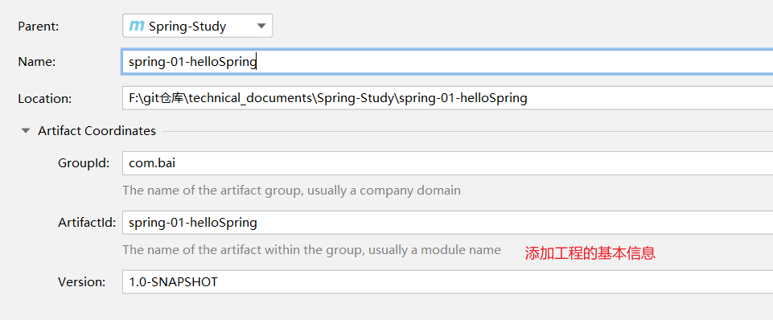

# 1. Spring 2020/10/25

## 1.1 简介

spring官网：https://spring.io/

spring Framework 核心框架文档：https://docs.spring.io/spring-framework/docs/current/spring-framework-reference/

spring maven仓库：

```xml
<dependency>
    <groupId>org.springframework</groupId>
    <artifactId>spring-webmvc</artifactId>
    <version>5.2.9.RELEASE</version>
</dependency>
```


## 1.2 Spring 的优点

- Spring 是一个开源免费的框架（容器）
- Spring 是一个轻量级、非入侵式的框架
- 控制反转（IOC）、面向切面编程（AOP）
- 支持事务的处理、对框架整合的支持

***总结：Spring 就是一个轻量级的控制反转（IOC）和面向切面编程（AOP）的框架***


## 1.3 Spring 的组成


# 2. Hello Spring

开始编写第一个 Spring Demo

1. 创建一个普通的 maven 项目

2. 添加 spring 依赖

   ```xml
   <dependency>
       <groupId>org.springframework</groupId>
       <artifactId>spring-webmvc</artifactId>
       <version>5.2.9.RELEASE</version>
   </dependency>
   ```

3. 删除 maven 项目的 src 文件夹

4. 将此项目作为父项目，在其里面创建一个个的测试demo，创建子 Module 

   

   

5. 创建 Hello 类

   ```java
   /**
    * @author: 南独酌酒 <211425401@126.com>
    * @date: 2020/10/25 11:21
    */
   public class Hello {
       private String str;
   
       public String getStr() {
           return str;
       }
   
       public void setStr(String str) {
           this.str = str;
       }
   
       @Override
       public String toString() {
           return "Hello{" +
                   "str='" + str + '\'' +
                   '}';
       }
   }
   ```

   

6. 在 resource 目录下创建 Spring 核心配置文件，取名为 beans.xml

   ```xml
   <?xml version="1.0" encoding="UTF-8"?>
   <beans xmlns="http://www.springframework.org/schema/beans"
          xmlns:xsi="http://www.w3.org/2001/XMLSchema-instance"
          xsi:schemaLocation="http://www.springframework.org/schema/beans
           https://www.springframework.org/schema/beans/spring-beans.xsd">
   
       <!--
       在 Spring 配置文件中添加 Hello 类的配置
       bean 就等于 Hello 对象
       id = 变量名 hello
       class 引用类的位置
       property 是给 Hello 类中的属性 str 赋值为 Hello Spring!!!
       ==================================================
       下面的意思就像在 Java 中创建对象一样
       Hello hello = new Hello();
       hello.setStr("Hello Spring!!!");
       =================================================
       只不过我们只是将创建对象的步骤交给了 Spring 容器来帮我们做
       实现了代码之间的解耦，这就是 IOC 的设计理念
       -->
       <bean id="hello" class="com.bai.pojo.Hello">
           <property name="str" value="Hello Spring!!!"/>
       </bean>
   
   </beans>
   ```

   

7. 测试

   首先在父项目的 pom.xml 文件中添加 junit 依赖，方便单元测试

   ```xml
   		<!-- 添加 junit 依赖 -->
           <dependency>
               <groupId>junit</groupId>
               <artifactId>junit</artifactId>
               <version>4.13</version>
           </dependency>
   ```

   ```java
   	@Test
       public void test01() {
           ApplicationContext context = new ClassPathXmlApplicationContext("beans.xml");
           Hello hello = (Hello) context.getBean("hello");
           System.out.println(hello.toString());
       }
   ```

   测试结果

   

***到了现在，我们彻底不用在程序中去改动代码了，要实现不同的操作，只需要在 xml 配置文件中进行修改，所谓的 IOC,一句话搞定：对象由 Spring 来创建、管理、装配***

# 3. IOC 创建对象的方式

1. **默认通过类的无参构造创建对象**

2. 通过类的带参构造创建对象分为三种方式

   - 通过下标创建对象

     ```xml
     <!-- 方式一：通过下标的方式创建对象 -->
         <bean id="hello" class="com.bai.pojo.Hello">
             <constructor-arg index="0" value="哪吒"/>
         </bean>
     ```

     

   - 通过 type 类型创建对象

     ```xml
     <!-- 方式二：通过 type 类型创建对象 -->
         <bean id="hello" class="com.bai.pojo.Hello">
             <constructor-arg type="java.lang.String" value="孙大圣"/>
         </bean>
     ```

   - 通过 name 的方式创建对象

     ```xml
     <!-- 方式三：通过 name 的方式创建对象 -->
         <bean id="hello" class="com.bai.pojo.Hello">
             <constructor-arg name="str" value="郭靖"/>
         </bean>
     ```

***总结：在配置文件加载的时候，容器中管理的所有都对象都已经初始化了！***

# 4. Spring 配置说明

## 4.1 alias 配置

```xml
<!-- alias 用于配置别名，配置了别名后，原本的 hello 和现在的 hello2 都可以使用 -->
<alias name="hello" alias="hello2"/>
```

## 4.2 bean 配置

```xml
<!--
    id 就是 bean 的唯一限定名
    class 就是 bean 引用的对象
    name 是别名，比 alias 更为高级，可以配置多个别名，别名之间也可以通过逗号，空格，分号分隔等等...
    -->
<bean id="hello" class="com.bai.pojo.Hello" name="h1,h2 h3;h4">
        <property name="str" value="李逵"/>
    </bean>
```

## 4.3 import 配置

import 配置用于引入其他 xml 中配置的信息

一般用于团队开发，假设现在有三个人开发此项目

员工 A：创建了 springBeanA.xml

员工 B：创建了 springBeanB.xml

员工 C：创建了 springBeanC.xml

这时由于三个人自己写的 xml 内容都不一样，可以通过 Import 配置来将三个人开发的内容引入到一个总的配置文件中去，一般总配置文件命名都为：applicationContext.xml

```xml
<import resource="springBeanA.xml"/>
<import resource="springBeanB.xml"/>
<import resource="springBeanC.xml"/>
```

***注意：就算三个 bean.xml 文件中有相同的数据时，取相同的 bean 时，也会随机取出其中一个 bean 用来使用的，并不会发生报错等情况！***

# 5. Spring 的依赖注入

## 5.1 构造函数注入

前面已经说过了

## 5.2 Set 方式注入

创建测试环境

- 创建实体类用于测试各种类型的注入

  ***Address 类***

  ```java
  import lombok.Data;
  
  /**
   * @author: 南独酌酒 <211425401@126.com>
   * @date: 2020/10/26 20:49
   */
  @Data
  public class Address {
      private String name;
  }
  ```

  ***Student 类***

  ```java
  import lombok.Data;
  
  import java.io.Serializable;
  import java.util.List;
  import java.util.Map;
  import java.util.Properties;
  import java.util.Set;
  
  /**
   * @author: 南独酌酒 <211425401@126.com>
   * @date: 2020/10/26 20:49
   */
  @Data
  public class Student implements Serializable {
      /**
       * 基本类型
       */
      private String name;
      /**
       * 引用类型
       */
      private Address address;
      /**
       * 空 null 类型
       */
      private String wife;
      /**
       * List 类型
       */
      private List<String> hobbys;
      /**
       * Set 类型
       */
      private Set<String> games;
      /**
       * Map 类型
       */
      private Map<String, String> card;
      /**
       * 数组类型
       */
      private String[] books;
      /**
       * 配置文件类型 Properties
       */
      private Properties info;
  }
  ```

  

- 创建 beans.xml 文件配置对象到 Spring 容器中去

  ```xml
  <?xml version="1.0" encoding="UTF-8"?>
  <beans xmlns="http://www.springframework.org/schema/beans"
         xmlns:xsi="http://www.w3.org/2001/XMLSchema-instance"
         xsi:schemaLocation="http://www.springframework.org/schema/beans
          https://www.springframework.org/schema/beans/spring-beans.xsd">
      <!-- Set 方式注入各种类型的属性 -->
      <bean id="student" class="com.bai.pojo.Student">
          <property name="name" value="大圣"/>
      </bean>
  </beans>
  ```

  

- 测试

  ```java
  public class MyTest {
      public static void main(String[] args) {
          ApplicationContext context = new ClassPathXmlApplicationContext("beans.xml");
          Student student = (Student) context.getBean("student");
          System.err.println(student.toString());
      }
  }
  ```

- 完善注入代码

  ```xml
  <?xml version="1.0" encoding="UTF-8"?>
  <beans xmlns="http://www.springframework.org/schema/beans"
         xmlns:xsi="http://www.w3.org/2001/XMLSchema-instance"
         xsi:schemaLocation="http://www.springframework.org/schema/beans
          https://www.springframework.org/schema/beans/spring-beans.xsd">
      <bean id="student" class="com.bai.pojo.Student">
          <!-- set 方式注入 -->
          <property name="name" value="大圣"/>
  
          <!-- 引用类型注入 -->
          <property name="address" ref="address"/>
  
          <!-- null 类型注入 -->
          <property name="wife">
              <null/>
          </property>
  
          <!-- List 类型注入 -->
          <property name="hobbys">
              <list>
                  <value>听歌</value>
                  <value>敲代码</value>
                  <value>打游戏</value>
              </list>
          </property>
  
          <!-- Set 类型注入 -->
          <property name="games">
              <set>
                  <value>LOL</value>
                  <value>CF</value>
                  <value>DNF</value>
              </set>
          </property>
  
          <!-- Map 类型注入 -->
          <property name="card">
              <map>
                  <entry key="身份证" value="111111222222223333"/>
                  <entry key="学号" value="123456798613"/>
              </map>
          </property>
  
          <!-- 数组类型注入 -->
          <property name="books">
              <array>
                  <value>红楼梦</value>
                  <value>西游记</value>
                  <value>水浒传</value>
                  <value>三国演义</value>
              </array>
          </property>
  
          <!-- Properties 类型注入 -->
          <property name="info">
              <props>
                  <prop key="邮箱">bai211425401@126.com</prop>
                  <prop key="公司">杭州阿里巴巴</prop>
                  <prop key="职业">程序猿</prop>
              </props>
          </property>
      </bean>
  
      <bean id="address" class="com.bai.pojo.Address">
          <property name="name" value="上海"/>
      </bean>
  </beans>
  ```

- 测试结果

  ```java
  	Student(
          name=大圣,
          address=Address(
              name=上海
          ),
          wife=null,
          hobbys=[听歌, 敲代码, 打游戏],
          games=[LOL, CF, DNF],
          card={
              身份证=111111222222223333,
              学号=123456798613
          },
          books=[红楼梦, 西游记, 水浒传, 三国演义],
          info={
              邮箱=bai211425401@126.com,
              公司=杭州阿里巴巴,
              职业=程序猿
          })
  ```

## 5.3 扩展方式注入

Spring 格外提供了两种命名空间的方式注入

分别为 c 命名空间和 p 命名空间

要想使用命名空间的方式注入，需要在 spring 容器中引入相关依赖配置

```xml
xmlns:p="http://www.springframework.org/schema/p"
xmlns:c="http://www.springframework.org/schema/c"
```

测试案例

- ***创建 User 类***

  ```java
  /**
   * @author: 南独酌酒 <211425401@126.com>
   * @date: 2020/10/26 21:25
   */
  public class User {
      private String name;
      private int age;
  
      public User() {
      }
  
      public User(String name, int age) {
          this.name = name;
          this.age = age;
      }
  
      public String getName() {
          return name;
      }
  
      public void setName(String name) {
          this.name = name;
      }
  
      public int getAge() {
          return age;
      }
  
      public void setAge(int age) {
          this.age = age;
      }
  
      @Override
      public String toString() {
          return "User{" +
                  "name='" + name + '\'' +
                  ", age=" + age +
                  '}';
      }
  }
  ```

  

- ***Spring 容器***

  ```xml
  <!-- c命名空间注入，通过 property 方式注入 -->
      <bean id="user" class="com.bai.pojo.User" p:name="小虎" p:age="3"/>
  
      <!-- p命名空间注入，通过 construct-args 方式注入 -->
      <bean id="user2" class="com.bai.pojo.User" c:name="刘大力" c:age="11"/>
  ```

  

- 测试

  ```java
   	@Test
      public void test02() {
          ApplicationContext context = new ClassPathXmlApplicationContext("beans.xml");
          User user = context.getBean("user2", User.class);
          System.out.println(user);
      }
  ```

  

# 6. Bean 的作用域


## 6.1 singleton


***将每个Spring IoC容器的单个bean定义范围限定为单个对象实例***

bean 的作用域默认就是单例模式，大家获取的 bean 都来自同一个

## 6.2 prototype


***将单个bean定义的作用域限定为任意数量的对象实例。***

每个 bean 都会产生一个不同的对象

------

***request session application 都来自 web***

# 7. Bean 的自动装配

搭建基础环境

- ***创建 Cat 类、Dog类，Person类引用猫类 Cat和狗类 Dog***

  ```java
  public class Cat {
      public void shout() {
          System.err.println("miao~");
      }
  }
  
  
  public class Dog {
      public void shout() {
          System.err.println("wang~");
      }
  }
  
  
  public class Person {
      private String name;
      private Cat cat;
      private Dog dog;
  
      public String getName() {
          return name;
      }
  
      public void setName(String name) {
          this.name = name;
      }
  
      public Cat getCat() {
          return cat;
      }
  
      public void setCat(Cat cat) {
          this.cat = cat;
      }
  
      public Dog getDog() {
          return dog;
      }
  
      public void setDog(Dog dog) {
          this.dog = dog;
      }
  
      @Override
      public String toString() {
          return "Person{" +
                  "name='" + name + '\'' +
                  ", cat=" + cat +
                  ", dog=" + dog +
                  '}';
      }
  }
  ```

## 7.1 byName 方式

```xml
	<bean id="cat" class="com.bai.pojo.Cat"/>
    <bean id="dog" class="com.bai.pojo.Dog"/>

    <!--
    byName 方式是自动寻找当前 Spring 山下问中设置的 beanId,必须保证 beanId 和尸体了中的 set方法的名称一致，否则就会报错
    -->
    <bean id="person" class="com.bai.pojo.Person" autowire="byName">
        <property name="name" value="小狂神"/>
    </bean>
```

## 7.2 byType 方式

```xml
	<bean id="cat" class="com.bai.pojo.Cat"/>
    <bean id="dog1321" class="com.bai.pojo.Dog"/>

    <!--
    byType 方式是自动寻找当前 Spring 上下文中设置的 bean 的 class 类型，必须保证 class 类型唯一，如果存在多个，就会报错
    -->
    <bean id="person" class="com.bai.pojo.Person" autowire="byType">
        <property name="name" value="小狂神"/>
    </bean>
```

## 7.3 通过注解实现自动装配

- 首先要在 spring 容器中配置支持注解

  - 添加注解的约束

    ```xml
    xmlns:context="http://www.springframework.org/schema/context"
    http://www.springframework.org/schema/context
    https://www.springframework.org/schema/context/spring-context.xsd"
    ```

    

  - 添加开启注解配置

    `context:annotation-config/>`

### @Autowired 注解

```java
public class Person {
    private String name;
    @Autowired
    private Cat cat;
    @Autowired
    private Dog dog;
}
```

可以添加到属性上面，也可以添加到 set 方法上

@Autowired 属性首先跟据类型去寻找对象，如果此对象有多个的情况下，可以使用@Qualifier(value = "xxx") 注解配置要寻找的 bean 的名称

如果名称和类型都匹配不到的话就会报错！

### @Resource 注解

```java
public class Person {
    private String name;
    @Resource
    private Cat cat;
    @Resource
    private Dog dog;
}
```

@Resource 注解首先跟据名称去寻找对应的 bean 对象，如果名字找不到就会跟据类型去寻找对应的 bean 对象，如果二者都找不到的话就会报错！


# 8. 使用注解开发

1. 要使用注解，首先要在项目中引入 context 的依赖包


2. 然后在 Spring 配置文件中添加 context 的约束并开启注解的配置

   ```xml
   <?xml version="1.0" encoding="UTF-8"?>
   <beans xmlns="http://www.springframework.org/schema/beans"
          xmlns:xsi="http://www.w3.org/2001/XMLSchema-instance"
          xmlns:context="http://www.springframework.org/schema/context"
          xsi:schemaLocation="http://www.springframework.org/schema/beans
           https://www.springframework.org/schema/beans/spring-beans.xsd
           http://www.springframework.org/schema/context
           https://www.springframework.org/schema/context/spring-context.xsd">
   
       <!-- 开启 spring 注解的配置 -->
       <context:annotation-config/>
       <!--
       开启 spring 注解要扫描包的位置, com.bai.pojo 包下的所有类都会去进行扫描,看看是否存在注解
       存在注解就会被注册到 spring 容器中来
       -->
       <context:component-scan base-package="com.bai.pojo"/>
   
   </beans>
   ```

## 8.1 @Component 注解

value 等价于给 bean 取了个别名

如果没有使用 value ，那么默认的名字就是类名的小写 `user`

```java
// 此行配置等价于 <bean id="user222" class="com.bai.pojo.User"/>
@Component(value = "user222")
public class User {
    public String name = "哪吒";
}
```

## 8.2 @Value 注解

```java
// 此行配置等价于 <property name="name" value="小白龙"/>
@Value("小白龙")
private String name;
```

## 8.3 衍生注解

***@Repository 注解***

***@Service 注解***

***@Controller注解***

这三个注解的作用等价与 @Component。

只不过是用来区分三层架构的模式。

## 8.4 @Scope 注解

```java
// 此行配置等价于 <bean id="user222" class="com.bai.pojo.User"/>
@Component(value = "user222")
// 作用域注解
@Scope(value = "prototype")
public class User {
    // 此行配置等价于 <property name="name" value="小白龙"/>
    @Value("小白龙")
    private String name;

    public String getName() {
        return name;
    }

    public void setName(String name) {
        this.name = name;
    }
}
```

## 8.5 小结

xml 与注解：

- xml 更加万能，适用于各种场合，维护简单方便
- 注解不是自己的类使用不了，维护相对复杂！

# 9. 使用注解替换xml配置

我们可以完全使用注解的方式替换掉 xml 方式来配置 Spring 

创建实体类

```java
import org.springframework.beans.factory.annotation.Value;
import org.springframework.stereotype.Component;

/**
 * @author: 南独酌酒 <211425401@126.com>
 * @date: 2020/10/27 22:18
 */
@Component
public class User {
    @Value("哪吒")
    private String name;

    public String getName() {
        return name;
    }

    public void setName(String name) {
        this.name = name;
    }

    @Override
    public String toString() {
        return "User{" +
                "name='" + name + '\'' +
                '}';
    }
}
```

创建配置类，替换掉 xml 配置

***配置了 @Configuration 注解就表示此类被 Spring 容器托管了，***

***@ComponentScan 扫描指定的包***

***@Bean 注解就等价于 bean 标签，getUser 等价于 bean 标签的 id，返回值类型就等价于 class 属性***

```java
import com.bai.pojo.User;
import org.springframework.context.annotation.Bean;
import org.springframework.context.annotation.ComponentScan;
import org.springframework.context.annotation.Configuration;

/**
 * @author: 南独酌酒 <211425401@126.com>
 * @date: 2020/10/27 22:19
 */
@Configuration
@ComponentScan("com.bai.pojo")
public class SpringConfig {

    @Bean
    public User getUser() {
        return new User();
    }

}
```

测试

***由于使用了全注解开发的方式，获取 spring 上下文也要通过 AnnotationConfig 方式读取到配置信息***

```java
 	@Test
    public void test1() {
        ApplicationContext context = new AnnotationConfigApplicationContext(SpringConfig.class);
        User getUser = context.getBean("getUser", User.class);
        System.out.println(getUser.getName());
    }
```

# 10. 代理模式

## 10.1 静态代理

代理模式的好处：

- 可以使真实角色的操作更加纯粹，不用去关注一些公共的业务
- 公共业务就交给代理角色！实现了业务的分工！
- 公共业务发生扩展的时候，方便集中管理！

缺点：

- **一个真实角色就会产生一个代理角色，代码量会翻倍，开发效率会变低！**

## 10.2 动态代理

- 动态代理和静态代理角色一样。
- **动态代理的代理类是动态生成的，不需要我们手动写，这是动态代理和静态代理最大的区别了。**
- 动态大力分为两大类：基于接口的动态代理，基于类的动态代理
  - 基于接口：JDK动态代理
  - 基于类：cglib
  - java字节码实现：javasist

需要了解两个类：***Proxy 代理***，***InvocationHandler 调用处理程序***

动态代理的好处：

- 可以使真实角色的操作更加纯粹，不用去关注一些公共的业务！
- 公共业务就交给代理角色！实现了业务的分工！
- 公共业务发生扩展的时候，方便集中管理！
- 一个动态代理类代理的是一个接口，一般就是对应的一类事务！
- 一个动态代理类可以代理多个类，只要是实现了同一个接口即可！

# 11. AOP

**使用 Spring 实现 AOP**

使用 API ，需要导入依赖包

```xml
<dependency>
    <groupId>org.aspectj</groupId>
    <artifactId>aspectjweaver</artifactId>
    <version>1.8.13</version>
</dependency>
```

## 11.1 使用原生 Spring API 接口实现 AOP

1. 创建 UserService 接口和 UserServiceImpl 实现类

   ```java
   public interface UserService {
       public void add();
       public void delete();
       public void update();
       public void select();
       public String console();
   }
   ```

   ```java
   public class UserServiceImpl implements UserService {
       @Override
       public void add() {
           System.out.println("添加了一个用户");
       }
   
       @Override
       public void delete() {
           System.out.println("删除了一个用户");
       }
   
       @Override
       public void update() {
           System.out.println("更新了一个用户");
       }
   
       @Override
       public void select() {
           System.out.println("查询了一个用户");
       }
   
       @Override
       public String console() {
           return "大胡子";
       }
   }
   ```

   

2. 创建 BeforeLog（前置增强） 和 AfterLog（后置增强） 增强日期类

   ```java
   public class BeforeLog implements MethodBeforeAdvice {
       /**
        * 方法前置增强
        *
        * @param method 要执行的目标对象的方法
        * @param args   参数
        * @param target 目标对象
        */
       @Override
       public void before(Method method, Object[] args, Object target) throws Throwable {
           System.err.println(target.getClass().getName() + "执行了" + method.getName() + "方法");
       }
   }
   ```

   ```java
   public class AfterLog implements AfterReturningAdvice {
       /**
        * 方法后置增强
        *
        * @param returnValue 方法的返回值
        * @param method      要执行的目标对象的方法
        * @param args        参数
        * @param target      目标对象
        */
       @Override
       public void afterReturning(Object returnValue, Method method, Object[] args, Object target) throws Throwable {
           System.err.println(target.getClass().getName() + "执行了" + method.getName() + "方法,返回值为" + returnValue);
       }
   }
   ```

   

3. 创建 Spring 核心配置文件 applicationContext.xml，注册 bean 和配置切入点

   ```xml
   <?xml version="1.0" encoding="UTF-8"?>
   <beans xmlns="http://www.springframework.org/schema/beans"
          xmlns:xsi="http://www.w3.org/2001/XMLSchema-instance"
          xmlns:aop="http://www.springframework.org/schema/aop"
          xsi:schemaLocation="http://www.springframework.org/schema/beans
           https://www.springframework.org/schema/beans/spring-beans.xsd
           http://www.springframework.org/schema/aop
           https://www.springframework.org/schema/aop/spring-aop.xsd">
       
       <!-- 注册 bean -->
       <bean id="userService" class="com.bai.service.UserServiceImpl"/>
       <bean id="beforeLog" class="com.bai.log.BeforeLog"/>
       <bean id="afterLog" class="com.bai.log.AfterLog"/>
   
       <!-- todo 方式一: 使用原生 Spring API 接口 -->
       <!-- 配置 aop: 需要导入 aop 的约束 -->
       <aop:config>
           <!-- 配置切入点  expression 表达式，要切入的位置-->
           <!--
           execution(* com.bai.service.UserServiceImpl.*(..)) 表达式的意思为；
           在com.bai.service.UserServiceImpl 类下的所有方法，所有参数匹配进切入点
           -->
           <aop:pointcut id="pointcut" expression="execution(* com.bai.service.UserServiceImpl.*(..))"/>
   
           <!-- 执行环绕增强 -->
           <aop:advisor advice-ref="beforeLog" pointcut-ref="pointcut"/>
           <aop:advisor advice-ref="afterLog" pointcut-ref="pointcut"/>
       </aop:config>
   
   </beans>
   ```

4. 测试

   ```java
   public class MyTest {
       @Test
       public void test01() {
           ApplicationContext context = new ClassPathXmlApplicationContext("applicationContext.xml");
           UserService userService = context.getBean("userService", UserService.class);
           userService.add();
           System.out.println("======================================");
           userService.console();
       }
   }	
   ```

5. 测试结果


## 11.2 自定义来实现 AOP

1. 自定义要切入的类

   ```java
   public class MyLogNotice {
       public void before() {
           System.err.println("方法执行前 >>>>>>");
       }
   
       public void after() {
           System.err.println("方法执行后 >>>>>>");
       }
   }
   ```

   

2. 在 applicatonContext.xml 中配置 aop

   ```xml
   <!-- todo 方式二：自定义实现 aop -->
       <bean class="com.bai.log.MyLogNotice" id="myLogNotice"/>
       <aop:config>
           <!-- 自定义切面 ref 要引用的类 -->
           <aop:aspect ref="myLogNotice">
               <!-- 定义切入点 -->
               <aop:pointcut id="pointcut" expression="execution(* com.bai.service.UserServiceImpl.*(..))"/>
               <!-- 通过 -->
               <aop:before method="before" pointcut-ref="pointcut"/>
               <aop:after method="after" pointcut-ref="pointcut"/>
           </aop:aspect>
       </aop:config>
   ```

3. 测试

   ```java
   public class MyTest {
       @Test
       public void test01() {
           ApplicationContext context = new ClassPathXmlApplicationContext("applicationContext.xml");
           UserService userService = context.getBean("userService", UserService.class);
           userService.add();
       }
   }
   ```

4. 测试结果

   

## 11.3 使用注解方式实现 AOP

1. 自定义切面类

   ```java
   import org.aspectj.lang.ProceedingJoinPoint;
   import org.aspectj.lang.annotation.After;
   import org.aspectj.lang.annotation.Around;
   import org.aspectj.lang.annotation.Aspect;
   import org.aspectj.lang.annotation.Before;
   
   /**
    * @author: 南独酌酒 <211425401@126.com>
    * @date: 2020/10/31 13:03
    */
   @Aspect // 标注此类为一个切面
   public class MyAnnotationAdvice {
       @Before("execution(* com.bai.service.UserServiceImpl.*(..))")
       public void before() {
           System.out.println("方法执行前======");
       }
   
       @Around("execution(* com.bai.service.UserServiceImpl.*(..))")
       public void around(ProceedingJoinPoint joinPoint) throws Throwable {
           System.out.println("方法环绕前======");
           // 方法签名
           System.out.println(joinPoint.getSignature());
           // 执行方法
           joinPoint.proceed();
           System.out.println("方法环绕后======");
       }
   
       @After("execution(* com.bai.service.UserServiceImpl.*(..))")
       public void after() {
           System.out.println("方法执行后======");
       }
   }
   ```

   

2. 在 spring 核心配置文件 applicatioinContext.xml 中配置开启 aop 注解扫描

   ```xml
   <!-- todo 方式三: 使用注解实现 aop -->
   <bean class="com.bai.log.MyAnnotationAdvice" id="myAnnotationAdvice"/>
   <!-- 开启aop注解扫描 -->
   <aop:aspectj-autoproxy/>
   ```

   

3. 测试

   ```java
   	@Test
       public void test01() {
           ApplicationContext context = new ClassPathXmlApplicationContext("applicationContext.xml");
           UserService userService = context.getBean("userService", UserService.class);
           userService.add();
       }
   ```

   

4. 测试结果

   

# 12. Spring 整合 MyBatis

1. Spring 整合 MyBatis 首先引入相关依赖

   - mysql 依赖
   - myBatis 依赖
   - spring 相关依赖
   - spring-jdbc 依赖
   - aop 植入依赖
   - mybatis-spring 依赖
   - Junit 单元测试依赖
   - lombok 简化开发依赖

   ```xml
   		<!-- mysql 连接依赖 -->
           <dependency>
               <groupId>mysql</groupId>
               <artifactId>mysql-connector-java</artifactId>
               <version>5.1.47</version>
           </dependency>
           <!-- mybatis 依赖 -->
           <dependency>
               <groupId>org.mybatis</groupId>
               <artifactId>mybatis</artifactId>
               <version>3.5.5</version>
           </dependency>
           <!-- spring 操作数据库依赖 -->
           <dependency>
               <groupId>org.springframework</groupId>
               <artifactId>spring-jdbc</artifactId>
               <version>5.3.0</version>
           </dependency>
           <!-- aop 植入依赖 -->
           <dependency>
               <groupId>org.aspectj</groupId>
               <artifactId>aspectjweaver</artifactId>
               <version>1.9.5</version>
           </dependency>
           <!-- mybatis 和 spring 整合的依赖 -->
           <dependency>
               <groupId>org.mybatis</groupId>
               <artifactId>mybatis-spring</artifactId>
               <version>2.0.4</version>
           </dependency>
   		<!-- 添加 Spring 相关依赖 -->
           <dependency>
               <groupId>org.springframework</groupId>
               <artifactId>spring-webmvc</artifactId>
               <version>5.2.9.RELEASE</version>
           </dependency>
           <!-- 添加 junit 依赖 -->
           <dependency>
               <groupId>junit</groupId>
               <artifactId>junit</artifactId>
               <version>4.13</version>
           </dependency>
           <!-- 添加 lombok 依赖 -->
           <dependency>
               <groupId>org.projectlombok</groupId>
               <artifactId>lombok</artifactId>
               <version>1.18.12</version>
           </dependency>
   ```

2. 创建数据库 mybatis 

   ```sql
   -- 创建测试数据库
   CREATE DATABASE `mybatis`;
   
   -- 使用此数据库
   USE `mybatis`;
   
   -- 创建 user 表
   CREATE TABLE user(
   	`id` INT(11) NOT NULL AUTO_INCREMENT PRIMARY KEY,
   	`name` VARCHAR(30) NOT NULL,
   	`pwd` VARCHAR(30) NOT NULL
   )ENGINE=INNODB CHARSET UTF8;
   
   -- 添加3条测试数据
   INSERT INTO user(`name`, `pwd`) VALUES
   ('张三', '864531'),
   ('李四', '1564513'),
   ('刘鹏飞', '9846513')
   ```

3. 创建 User 类

   ```java
   @Data
   public class User {
       private Integer id;
       private String name;
       private String pwd;
   }
   ```

4. 创建 UserMapper 接口和 UserMapper.xml 文件

   ```java
   public interface UserMapper {
       public List<User> getUserList();
   }
   ```

   ```xml
   <?xml version="1.0" encoding="UTF-8" ?>
   <!DOCTYPE mapper
           PUBLIC "-//mybatis.org//DTD Mapper 3.0//EN"
           "http://mybatis.org/dtd/mybatis-3-mapper.dtd">
   <mapper namespace="com.bai.mapper.UserMapper">
       <select id="getUserList" resultType="com.bai.pojo.User">
           select * from user;
       </select>
   </mapper>
   ```

5. 创建 MyBatis 核心配置文件 ***mybatis-config.xml*** 

   ```xml
   <?xml version="1.0" encoding="UTF-8" ?>
   <!DOCTYPE configuration
           PUBLIC "-//mybatis.org//DTD Config 3.0//EN"
           "http://mybatis.org/dtd/mybatis-3-config.dtd">
   <configuration>
       <!-- todo 基本设置 -->
       <settings>
           <!-- todo STDOUT_LOGGING 日志实现 -->
           <setting name="logImpl" value="STDOUT_LOGGING"/>
       </settings>
   </configuration>
   ```

6. 创建 ***spring-mybatis.xml*** 文件，用于将 MyBatis 整合进 Spring 中去。

   - 配置数据源 dataSource 连接数据库
   - 配置 SqlSessionFactory 引用数据源 dataSource，然后在绑定 MyBatis 相关配置文件，可以通过 **configLocation** 找到上一步创建的 mybatis-config.xml ，在通过 mapperLocations 配置相关的 xml 文件，用于执行编写的 sql 语句。
   - 最后通过配置 SqlSessionTemplate 来操作，SqlSessionTemplate 等同于 SqlSession 对象，都是用来执行 Sql 语句的。

   ```xml
   <?xml version="1.0" encoding="UTF-8"?>
   <beans xmlns="http://www.springframework.org/schema/beans"
          xmlns:xsi="http://www.w3.org/2001/XMLSchema-instance"
          xsi:schemaLocation="http://www.springframework.org/schema/beans
           https://www.springframework.org/schema/beans/spring-beans.xsd">
   
       <!-- todo: 配置数据源连接数据库 -->
       <bean id="dataSource" class="org.springframework.jdbc.datasource.DriverManagerDataSource">
           <property name="driverClassName" value="com.mysql.jdbc.Driver"/>
           <property name="url"
                     value="jdbc:mysql://localhost:3306/mybatis?useSSL=true&amp;useUnicode=true&amp;characterEncoding=utf8"/>
           <property name="username" value="root"/>
           <property name="password" value="123456"/>
       </bean>
   
       <!-- todo: 配置 SqlSessionFactory -->
       <bean id="sqlSessionFactory" class="org.mybatis.spring.SqlSessionFactoryBean">
           <property name="dataSource" ref="dataSource"/>
           <!-- 绑定 MyBatis 配置文件 -->
           <property name="configLocation" value="mybatis-config.xml"/>
           <property name="mapperLocations" value="classpath:com/bai/mapper/*.xml"/>
       </bean>
   
       <!-- todo: 配置 SqlSessionTemplate -->
       <!-- SqlSessionTemplate 等同于 SqlSession -->
       <bean id="sqlSession" class="org.mybatis.spring.SqlSessionTemplate">
           <!-- 只能通过构造器注入 SqlSessionTemplate -->
           <!-- 因为 SqlSessionTemplate 此类中并没有 set 方法 -->
           <constructor-arg name="sqlSessionFactory" ref="sqlSessionFactory"/>
       </bean>
   
   </beans>
   ```

7. 创建 UserMapperImpl 实现 UserMapper 接口

   ```java
   import com.bai.pojo.User;
   import org.mybatis.spring.SqlSessionTemplate;
   
   import java.util.List;
   
   public class UserMapperImpl implements UserMapper {
       private SqlSessionTemplate sqlSession;
   
       public void setSqlSession(SqlSessionTemplate sqlSession) {
           this.sqlSession = sqlSession;
       }
   
       public List<User> getUserList() {
           return sqlSession.getMapper(UserMapper.class).getUserList();
       }
   }
   ```

   

8. 创建Spring核心配置文件 ***applicationContext.xml*** ，将 UserMapperImpl 注册进 Spring 中去。

   ```xml
   <?xml version="1.0" encoding="UTF-8"?>
   <beans xmlns="http://www.springframework.org/schema/beans"
          xmlns:xsi="http://www.w3.org/2001/XMLSchema-instance"
          xmlns:aop="http://www.springframework.org/schema/aop"
          xsi:schemaLocation="http://www.springframework.org/schema/beans
           https://www.springframework.org/schema/beans/spring-beans.xsd
           http://www.springframework.org/schema/aop
           https://www.springframework.org/schema/aop/spring-aop.xsd">
       <!-- 引入 spring 整合 mybatis 的配置 -->
       <import resource="spring-mybatis.xml"/>
   
       <bean id="userMapper" class="com.bai.mapper.UserMapperImpl">
           <property name="sqlSession" ref="sqlSession"/>
       </bean>
   
   </beans>
   ```

9. 测试

   ```java
   public class MyTest {
       @Test
       public void test01() {
           ApplicationContext context = new ClassPathXmlApplicationContext("applicationContext.xml");
           UserMapper userMapper = context.getBean("userMapper", UserMapper.class);
           for (User user : userMapper.getUserList()) {
               System.out.println(user);
           }
       }
   }
   ```

10. 输出结果

    

**通过 SqlSessionDaoSupport 简化开发**

我们自己的实现类只需要继承了 SqlSessionDaoSupport 即可通过 getSqlSession() 方法获取到 Sqlsession 对象，然后通过 SqlSession 就可以操作数据库了。

实现方式：

1. 创建 UserMapperImpl2 实现 UserMapper 接口

   ```java
   import com.bai.pojo.User;
   import org.mybatis.spring.support.SqlSessionDaoSupport;
   
   import java.util.List;
   
   public class UserMapperImpl2 extends SqlSessionDaoSupport implements UserMapper {
       public List<User> getUserList() {
           return getSqlSession().getMapper(UserMapper.class).getUserList();
       }
   }
   ```

   

2. 将 UserMapperImpl2 注册进 applicationContext.xml 中去。

   ```xml
   <bean id="userMapper2" class="com.bai.mapper.UserMapperImpl2">
   	<property name="sqlSessionFactory" ref="sqlSessionFactory"/>
   </bean>
   ```

   

3. 测试同上，只需要将 getBean 获取的名字改成 userMapper2 即可，测试结果同上。

# 13. Spring 的事务

事务的特性：ACID，保证一组业务要么同时成功，要么同时失败！

- 原子性
- 一致性
- 隔离性
- 持久性

Spring 中的事务非为两种

- 声明式事务：通过 AOP 实现
- 编程式事务：通过在代码中，进行事务的管理

## 13.1 Spring 实现声明式事务

在 Spring 容器中通过 aop 织入事务的支持

首先使用  aop 要引入约束：

```xml
<?xml version="1.0" encoding="UTF-8"?>
<beans xmlns="http://www.springframework.org/schema/beans"
       xmlns:xsi="http://www.w3.org/2001/XMLSchema-instance"
       xmlns:tx="http://www.springframework.org/schema/tx"
       xmlns:aop="http://www.springframework.org/schema/aop"
       xsi:schemaLocation="http://www.springframework.org/schema/beans
        https://www.springframework.org/schema/beans/spring-beans.xsd
        http://www.springframework.org/schema/tx
        https://www.springframework.org/schema/tx/spring-tx.xsd
        http://www.springframework.org/schema/aop
        https://www.springframework.org/schema/aop/spring-aop.xsd">

    <!-- todo: 配置数据源连接数据库 -->
    <bean id="dataSource" class="org.springframework.jdbc.datasource.DriverManagerDataSource">
        <property name="driverClassName" value="com.mysql.jdbc.Driver"/>
        <property name="url"
                  value="jdbc:mysql://localhost:3306/mybatis?useSSL=true&amp;useUnicode=true&amp;characterEncoding=utf8"/>
        <property name="username" value="root"/>
        <property name="password" value="123456"/>
    </bean>

    <!-- todo: 配置 SqlSessionFactory -->
    <bean id="sqlSessionFactory" class="org.mybatis.spring.SqlSessionFactoryBean">
        <property name="dataSource" ref="dataSource"/>
        <!-- todo 绑定 MyBatis 配置文件 -->
        <property name="configLocation" value="mybatis-config.xml"/>
        <property name="mapperLocations" value="classpath:com/bai/mapper/*.xml"/>
    </bean>

    <!-- todo: 配置 SqlSessionTemplate -->
    <!-- todo SqlSessionTemplate 等同于 SqlSession -->
    <bean id="sqlSession" class="org.mybatis.spring.SqlSessionTemplate">
        <!-- todo 只能通过构造器注入 SqlSessionTemplate -->
        <!-- todo 因为 SqlSessionTemplate 此类中并没有 set 方法 -->
        <constructor-arg name="sqlSessionFactory" ref="sqlSessionFactory"/>
    </bean>

    <!-- todo 配置声明式事务 -->
    <bean id="transactionManager" class="org.springframework.jdbc.datasource.DataSourceTransactionManager">
        <property name="dataSource" ref="dataSource"/>
    </bean>

    <!-- todo 结合 AOP 实现事务的织入 -->
    <!-- todo 配置事务通知 -->
    <tx:advice id="txAdvice" transaction-manager="transactionManager">
        <!-- todo 给需要事务的方法进行定制化配置 -->
        <tx:attributes>
            <tx:method name="add" propagation="REQUIRED"/>
            <tx:method name="delete" propagation="REQUIRED"/>
            <tx:method name="update" propagation="REQUIRED"/>
            <tx:method name="*" propagation="REQUIRED"/>
        </tx:attributes>
    </tx:advice>

    <!-- todo 配置事务切入 -->
    <aop:config>
        <aop:pointcut id="txPointCut" expression="execution(* com.bai.mapper.*.*(..))"/>
        <aop:advisor advice-ref="txAdvice" pointcut-ref="txPointCut"/>
    </aop:config>

</beans>
```

在 UserMapperImpl 中人为制造错误。

```java
public List<User> getUserList() {
        User user = new User(5, "马小跳", "999");
        addUser(user);
        int i = 1 / 0;	// 这样程序执行必定会报错 
        return getSqlSession().getMapper(UserMapper.class).getUserList();
    }
```

观察数据库是否能够添加成功，添加了声明式事务后，程序发生异常，数据会直接回滚。

涉及数据比较重要的场景，一定要注意使用事务，不能马虎。