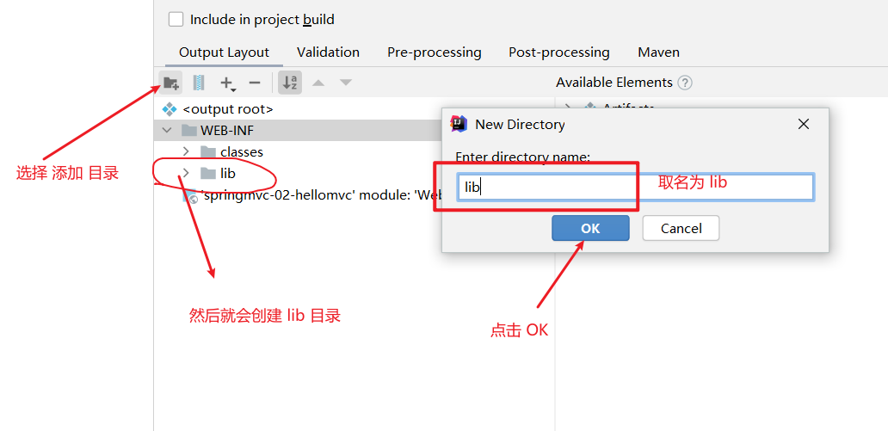
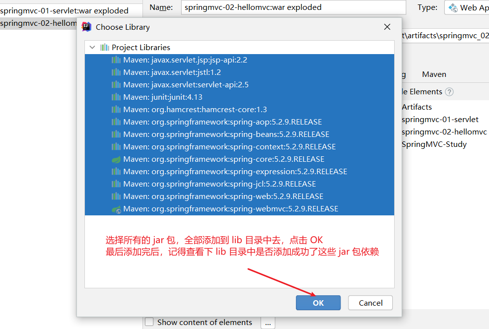

# 1. Spring MVC

Spring MVC 的特点：

1. 轻量级，简单易学
2. 高效，基于请求响应的 MVC 框架
3. 与 Spring 兼容性好，无缝结合
4. 约定大于配置
5. 功能强大：RESTful、数据验证、格式化、本地化、主题..
6. 简洁灵活

## 1.1 编写 HelloSpringMVC

1. 创建一个普通的 maven 项目，然后引入依赖

   ```xml
   	<dependencies>
           <!-- junit 单元测试 -->
           <dependency>
               <groupId>junit</groupId>
               <artifactId>junit</artifactId>
               <version>4.13</version>
           </dependency>
           <!-- springmvc -->
           <dependency>
               <groupId>org.springframework</groupId>
               <artifactId>spring-webmvc</artifactId>
               <version>5.2.9.RELEASE</version>
           </dependency>
           <!-- servlet -->
           <dependency>
               <groupId>javax.servlet</groupId>
               <artifactId>servlet-api</artifactId>
               <version>2.5</version>
           </dependency>
           <!-- jsp -->
           <dependency>
               <groupId>javax.servlet.jsp</groupId>
               <artifactId>jsp-api</artifactId>
               <version>2.2</version>
           </dependency>
           <!-- jstl 表达式 -->
           <dependency>
               <groupId>javax.servlet</groupId>
               <artifactId>jstl</artifactId>
               <version>1.2</version>
           </dependency>
       </dependencies>
   ```

   

2. 在项目上右击选择 Add FrameWork Support 添加框架支持

   

3. 选择 Web Application 支持，点击确定后，项目中就会出现 web 目录，然后你的项目就会支持编写一些 servlet 的配置了

   

4. 去编辑 web/WEB-INF/web.xml  文件

   ```xml
   <?xml version="1.0" encoding="UTF-8"?>
   <web-app xmlns="http://xmlns.jcp.org/xml/ns/javaee"
            xmlns:xsi="http://www.w3.org/2001/XMLSchema-instance"
            xsi:schemaLocation="http://xmlns.jcp.org/xml/ns/javaee http://xmlns.jcp.org/xml/ns/javaee/web-app_4_0.xsd"
            version="4.0">
   
       <!-- todo 注册 DispatcherServlet -->
       <servlet>
           <servlet-name>springmvc</servlet-name>
           <servlet-class>org.springframework.web.servlet.DispatcherServlet</servlet-class>
           <!-- todo 关联一个 springmvc 的配置文件：【servlet-name】-servlet.xml -->
           <init-param>
               <param-name>contextConfigLocation</param-name>
               <param-value>classpath:springmvc-servlet.xml</param-value>
           </init-param>
           <!-- todo 启动级别-1 -->
           <load-on-startup>1</load-on-startup>
       </servlet>
   
       <!-- todo / 匹配所有的请求：不包括 .jsp -->
       <!-- todo /* 匹配所有的请求：包括 .jsp -->
       <servlet-mapping>
           <servlet-name>springmvc</servlet-name>
           <url-pattern>/</url-pattern>
       </servlet-mapping>
   
   </web-app>
   ```

   

5. 在 resources 下创建 springmvc-servlet.xml 文件

   ```xml
   <?xml version="1.0" encoding="utf-8"?>
   <beans xmlns="http://www.springframework.org/schema/beans"
          xmlns:xsi="http://www.w3.org/2001/XMLSchema-instance"
          xsi:schemaLocation="http://www.springframework.org/schema/beans
          http://www.springframework.org/schema/beans/spring-beans.xsd">
   
       <bean class="org.springframework.web.servlet.handler.BeanNameUrlHandlerMapping"/>
       <bean class="org.springframework.web.servlet.mvc.SimpleControllerHandlerAdapter"/>
   
       <!-- todo 视图解析器: DispatcherServlet 给他的 ModelAndView -->
       <bean class="org.springframework.web.servlet.view.InternalResourceViewResolver" id="internalResourceViewResolver">
           <!-- todo 前缀 -->
           <property name="prefix" value="/WEB-INF/jsp/"/>
           <!-- todo 后缀 -->
           <property name="suffix" value=".jsp"/>
       </bean>
   
       <!-- Handler -->
       <bean id="/hello" class="com.bai.controller.HelloController"/>
   
   </beans>
   ```

   

6. 创建 HelloController 类

   ```java
   import org.springframework.web.servlet.ModelAndView;
   import org.springframework.web.servlet.mvc.Controller;
   
   import javax.servlet.http.HttpServletRequest;
   import javax.servlet.http.HttpServletResponse;
   
   /**
    * @author: 南独酌酒 <211425401@126.com>
    * @date: 2020/11/1 12:02
    */
   public class HelloController implements Controller {
   
       public ModelAndView handleRequest(HttpServletRequest httpServletRequest, HttpServletResponse httpServletResponse) throws Exception {
           // ModelAndView 模式和视图
           ModelAndView mv = new ModelAndView();
   
           // 封装对象,放在 ModelAndView 中
           mv.addObject("msg", "HelloSpringMVC");
   
           // 封装要跳转的视图，放在 ModelAndView 中
           mv.setViewName("hello");    // /WEB-INF/jsp/hello.jsp
           return mv;
       }
   }
   ```

   

7. 在项目 web/WEB-INF/ 下创建 jsp 文件夹，然后在这个文件夹下创建 hello.jsp ，最后 hello.jsp 完整路径为：/web/WEB-INF/jsp/hello.jsp

   ```jsp
   <%--
     Created by IntelliJ IDEA.
     User: bai
     Date: 2020/11/1
     Time: 12:05
     To change this template use File | Settings | File Templates.
   --%>
   <%@ page contentType="text/html;charset=UTF-8" language="java" %>
   <html>
   <head>
       <title>Title</title>
   </head>
   <body>
   <h1>${msg}</h1>
   </body>
   </html>
   ```

8. 配置 tomcat 

   

   

9. 配置 Deployment

   

10. 配置完后启动 tomcat 测试访问：***http://localhost:8080/hello***

****

***注意点：如果第一次访问出现 404，这个问题可能就是项目 jar 没有编译到项目中去***

如何解决 404 问题：

1. 选择 Project Structure 选项


2. 

3. 第一次访问 404 ，那么 lib 目录肯定是不存在的，那么就需要手动添加一下 lib 目录了。

   

4. 然后 lib 目录添加成功后，然后为其配置 jar 包即可。

   

   

5. 等所有东西都配置完成后，然后重新启动 tomcat ，再次访问 http://localhost:8080/hello 即可

6. 测试结果


# 2. RESTful 风格

RESTFul 风格的好处

- 便捷
- 高效
- 安全

原来的请求地址：http://localhost:8080/hello1?a=1&b=2

Restful 的请求地址：http://localhost:8080/hello/1/2

实现方法，通过 @PathVariable 注解添加到方法参数上即可

```java
 	@GetMapping(value = "/t2/{a}/{b}")
    public String test2(@PathVariable int a, @PathVariable int b, Model model) {
        int res = a + b;
        model.addAttribute("msg", "结果为：" + res);
        return "hello";
    }
```

**通过 @PathVariable 注解添加到 a b 变量上面，然后 @GetMapping 中的请求地址拼接写法可以写成：{参数名}  这样的写法即可将 url 上传的变量值赋给 a 这个参数**